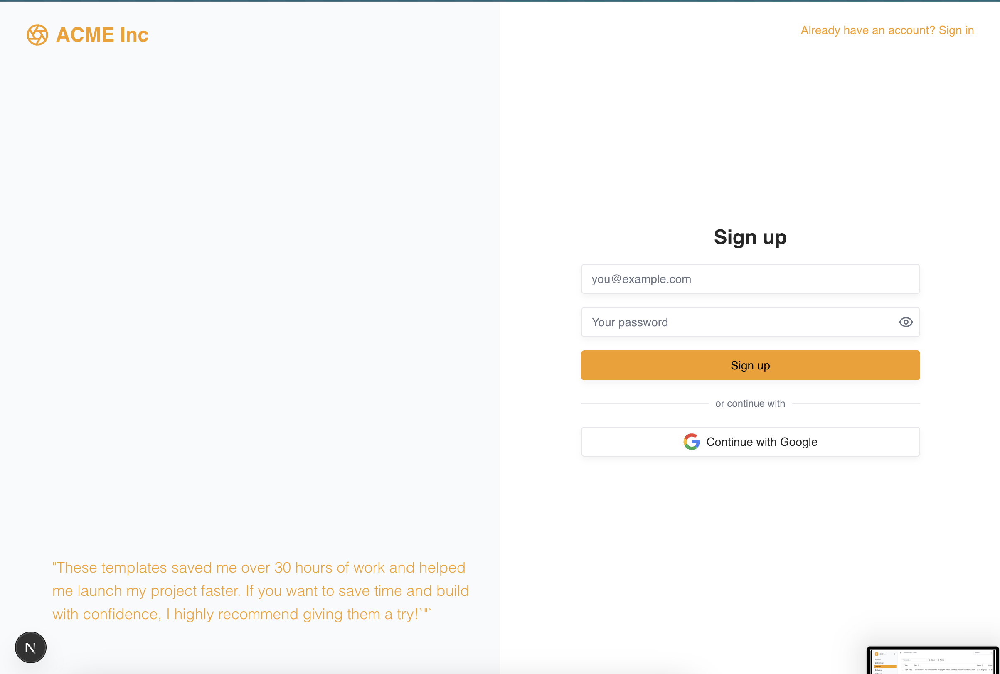

# Next.js Dashboard

I got tired of stitching together yet-another dashboard from scratch, so I built one that’s:

- 🎨 **Fully theme-able** — swap colors & fonts by tweaking `globals.css`  
  (Check out [tweak-cn](https://github.com/shadcn-ui/tweak-cn) to mix and match different themes—it's honestly like magic)
- 📱 **Mobile-ready** out of the box
- 🌓 **Light & dark modes** (auto-detects system preferences)
- 🔐 **Auth pages included** (clean signup and login pages)
- ✅ **Built-in Zod validations** — everything is strongly typed
- ✨ **100% TypeScript + shadcn/ui components**

---

## Screenshots

|                    Light Dashboard                     |                  Dark Tasks                  |
| :----------------------------------------------------: | :------------------------------------------: |
|  |  |

|                  Light Tasks                   |                   Light Signup                   |
| :--------------------------------------------: | :----------------------------------------------: |
|  |  |

---

## Getting Started

1. **Install dependencies:**

   ```bash
   npm install
   # or
   yarn
   # or
   pnpm install
   # or
   bun install
   ```

2. **Run the development server:**

   ```bash
   npm run dev
   # or
   yarn dev
   # or
   pnpm dev
   # or
   bun dev
   ```

3. Open [http://localhost:3000](http://localhost:3000) in your browser.

---

## Customization

- Edit `src/app/globals.css` to tweak colors, fonts, and themes.
- All UI components are built with [shadcn/ui](https://ui.shadcn.com/).
- Auth pages and Zod validation are included out of the box.

---

## Tech Stack

- [Next.js](https://nextjs.org/)
- [TypeScript](https://www.typescriptlang.org/)
- [shadcn/ui](https://ui.shadcn.com/)
- [Zod](https://zod.dev/)

---

## License

MIT

To add the auth secret

run

```code
npx auth secret
```
